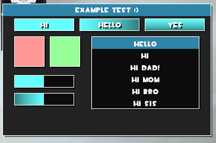
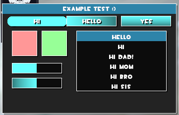
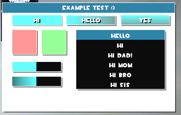
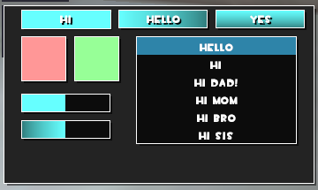

# **Please download alib.lua from Releases page!!!**
I like making useless things that probably only I will use :)

**Use a version from the releases page if possible, they are all (possibly) stable enough to be released**

If you want to create custom themes for alib, please use `default.json` as a base or example on where to start. You have to add them to alib/themes. It will be updated (if needed) every time a new alib version releases.
Please don't forget to rename it to another name, `default.json` always goes back to default when alib is loaded

The lib auto updates so you don't have to worry about downloading a new version again, unless the updater is updated then you'll have to download it

currently this has `window, button, checkbox, slider and list` support

read the wiki if you have any problem

im **NOT** adding `combobox` or `textbox` to the lib, as they are just other versions of `button` with special behaviour

Intro text

Preview of the example.lua:

`alib.settings.button.round = true`

White background to see the shadows

Window without a title (it automatically resizes itself)

